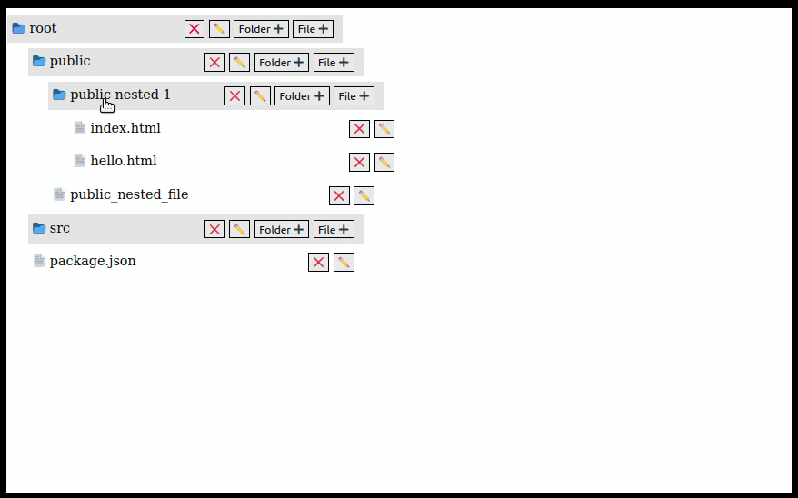

## What is the project about
 Folder structure project is copy of the folder structure we see in the left panel of VSCode. 

 1) We can create new folder and files
 2) We can create folder and files inside a folder 
 3) We can delete and edit them also

## To run the project

1) Clone the repo  
2) cd folder-structure && npm install  
3) npm start  

## Project Result 

## If you like my solution then please don't forget to star the repoa and share your solution on social. You can tag me there :-)